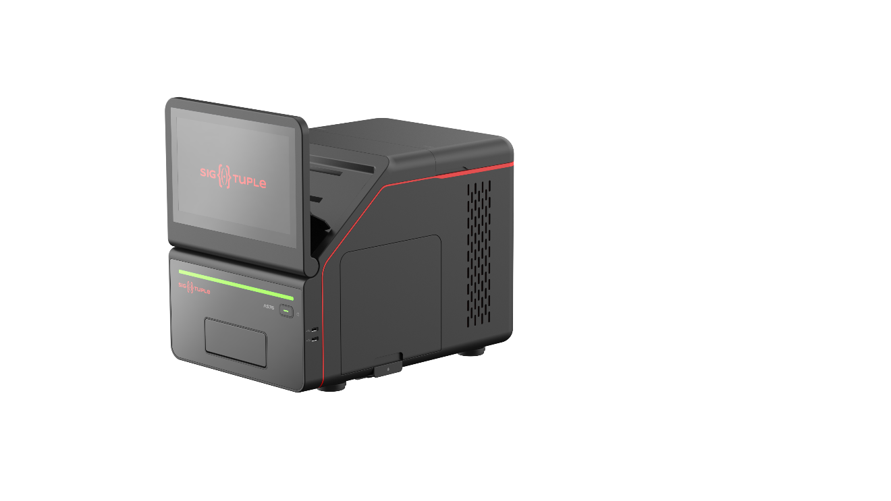

= Clinical Evaluation of AS76 with PBS versus light microscopy
:pdf-theme: my-theme.yml 
:sectnums:
:author: (C) SigTuple Technologies Pvt. Ltd

[.large_black_text]
*Protocol Number: CES-AS76PBS-CE-001* +
run
[.large_black_text]
*Sponsor:* SigTuple Technologies Pvt Ltd 
[black, fontsize=30]

<<<

[.head]
==  Sponsor Approval

I have reviewed the protocol. To the best of my knowledge, the protocol is accurate and complete. I approve this version as the final copy and consider it acceptable for regulatory submission. 

|===
| Reviewer | Title | Affiliation | Signature | Date

| Dr. Tathagato Rai Dastidar | Chief Executive Officer | SigTuple |  | 15-Jul-2024
|===
//
Protocol Revision History 
|===
| Version # | Modification | Issued By | Approved By | Issue Date

| 1.0 | - | Apurv Manjrekar | Dr. Tathagato Rai Dastidar | 15-Jul-2024
|===

<<<

[.text-center]
*PROTOCOL MODIFICATIONS AND DEVIATIONS*

Neither the Sponsor nor the investigator may modify this protocol without obtaining written concurrence of the other. The investigator in conjunction with Sponsor will submit protocol modifications to the Institutional Review Board (IRB) as necessary. Any non-approved deviations from this protocol are to be reported to Sponsor and to the IRB (if IRB approval for this diagnostic study is required) within 24 hours.

<<<

[.text-center]
*INVESTIGATOR'S STATEMENT AND SIGNATURE*
[%hardbreaks]
I agree to conduct this clinical study in accordance with the design and specific provisions of this protocol, Good Clinical Practice, and the applicable regulatory requirements.
I understand that modifications to the study or protocol are acceptable only with a mutually agreed upon protocol amendment. I agree to record, report and analyze any deviation in the study plan, and to notify any deviation to the Sponsor and study coordinator within the agreed time frames. 
I agree to permit trial-related monitoring, audits, IRB/IEC review (if IRB approval is required), and regulatory inspection(s) by providing direct access to source data/documents. 

[frame="none", grid="none"]
|===
| +_______________________________________+ | +_____________________________+
| Signature                              | Date
2+| +______________________________________________________________________________+ 
2+|Printed Investigator Name
|===

<<<
[.head]
== Protocol Synopsis
=== Protocol Name
Clinical performance evaluation of AS76 with PBS versus light microscopy.

[.subhead]
=== Sponsor details

Organization: SigTuple Technologies Private Limited. +
Principal: Tathagato Rai Dastidar (trd@sigtuple.com) +
Address: L-162, 14^th^ Cross Road, Sector-6 HSR Layout, Bangalore – 560102 (Karnataka, India).

[.subhead]
=== Name of the investigational device
SigTuple AS76 with PBS (here-on referred to as the AS76 system)

[.subhead]
=== Study objective
The objective of this study is to evaluate the clinical performance of the AS76 with PBS system using peripheral blood smear (here-on referred to as PBS) and establish equivalence with the reference method, manual review under a light microscope.

[.subhead]
=== Study endpoint
The endpoint of the study is the comparison of operator classified results of White Blood Cell (WBC) morphologies, Red Blood Cell (RBC) morphologies and Platelet (PLT) morphologies against manual microscopy using multiple statistical measures.

[.subhead]
=== Study sites
The study shall be conducted at two sites.

[.subhead]
=== Study design

. The study shall enroll at least 200 blood samples at each site. The sample distribution shall align with the recommendations of the CLSI H20-A2 standard^<<S2>>^.
. For each sample enrolled in the study, two PBS slides shall be prepared. One of the slides will be named 'A' and the other 'B'. Slide A shall be used in the study. Slide B shall only be used if slide A becomes unviable.
. Each PBS slide shall be scanned on the AS76 system and reviewed under a light microscope.
. Two qualified reviewers, at each site, are required for the study. Each slide shall be reviewed by both the qualified reviewers on the AS76 system and under a light microscope.

[.subhead]
=== Guiding standards
This study shall be guided by the following standards -

. CLSI H20-A2, Reference Leukocyte (WBC) Differential Count (Proportional) and Evaluation of Instrumental Methods

. CLSI EP09c, Measurement Procedure Comparison and Bias Estimation Using Patient Samples, 3rd Edition

. CLSI EP12 - A User Protocol for Evaluation of Qualitative Test Performance; Approved Guideline

. ICSH recommendations for the standardization of nomenclature and grading of peripheral blood cell morphological features

[.subhead]
===	Candidate method
Manual review of the report prepared by the AS76 system for a PBS slide on its reporting application by the investigator.

[.subhead]
===	Reference method
Manual review of a PBS slide under a light microscope by the investigator.

[.subhead]
===	Study workflow
This study is a retrospective, “all comers” multi-site study. The study shall involve enrollment of residual peripheral blood samples collected at the laboratory as part of its regular operations subject to the sample distribution guidelines (Please see - <<sample, Sample distribution>>). The study workflow shall be as follows –

. A PBS slide shall be prepared from each blood sample enrolled in the study.
. The slide shall be scanned on the AS76 system. The AS76 system shall locate blood cells on the slide and classify the WBC morphologies, characterize the RBC morphologies and the platelet morphologies. The system shall prepare a report for the slide.
. A duplicate system generated report will be created to enable both reviewers to review independently of each other.
. Each qualified reviewer shall review the duplicate report prepared by the AS76 system, make corrections where necessary and approve the report.
. Each qualified reviewer shall review the slide under a light microscope and prepare a report.
. The results from the two methods shall be compared.

Please note the following -

. The WBC differential count shall be performed on a minimum of 200 cells on each method (except in the case of leukopenia samples that may have fewer than 200 cells on the smear).
. Each site shall process different samples. The samples shall not be shared across sites.
. Each sample shall be run on a Hematology analyzer (also referred to as a cell counter) that can flag abnormal samples.
. The sample distribution shall be determined using the results obtained from the reference method (manual microscopy).

[.subhead]
=== Study samples
At least 200 fresh K~2~EDTA/K~3~EDTA blood samples shall be included in the study at each of the two sites. The sample set shall align with the recommendations of the CLSI H20-A2 standard^<<S2>>^. The samples shall be collected from residual blood samples collected by the laboratory as part of its regular operations.

[.subhead2]
==== Sample inclusion criteria
The study is an “all comers” study that shall include samples from healthy individuals and samples from individuals with various hematological conditions and distributional abnormalities such as anemia, thrombocytopenia, leukopenia, leukocytosis, elevated hematocrit, elevated nucleated red blood cells, leukemia, etc. The abnormal samples shall align with the recommendations of the CLSI H20-A2 standard^<<S2>>^. Samples from both genders shall be used. Samples from individuals belonging to any race/ethnicity can be used.

[.subhead2]
==== Sample exclusion criteria
The following sample exclusion criteria shall be applied -
. Slides that are not prepared adequately shall be excluded from the study. For example – slides that are not smeared well or are stained poorly.
. Slides that have been prepared from degenerated blood and are considered unsuitable for evaluation by the qualified reviewers after examination under a light microscope (as per the standard procedures of the laboratory).
. Slides considered unsuitable for evaluation by the qualified reviewers after examination under light microscope (as per the laboratory's standard procedures).

[.subhead]
=== Study duration
The study shall be considered closed for data when the study assessment for the last subject participating in the study is completed and recorded. 

The duration of the study shall depend on sufficient sample collection, meeting the predefined sample distribution, and the review rate of the qualified reviewers.

[.subhead]
=== Documents required from the study site
The following documents shall be required from each of the study sites -

. Anonymized hematology analyzer report for the blood sample.

. Manual microscopy reports from each of the qualified reviewers at the site.
The site shall remove all personally identifiable information such as patient name, birth date, address and phone number before sharing the reports.

[.subhead]
=== Statistics

[.subhead2]
====	White blood cells
For the differential count (percentage) of Neutrophils, Lymphocytes, Eosinophils and Monocytes, the following statistical parameters shall be evaluated^3^ -

. Regression slope

. Intercept

. Bias

. Pearson's correlation co-efficient

Please note that the 95% CI limit values shall also be evaluated for each of the regression parameters.
For distributional abnormalities (high or low count of Neutrophils, Lymphocytes, Eosinophils, Monocytes and Basophils) and morphological abnormalities (Immature Granulocytes, Atypical cells/Blasts and NRBCs), the following statistical parameters shall be evaluated^<<S3>>^ -
. Sensitivity
. Specificity
. Overall agreement
Please note that the 95% CI limit values shall also be evaluated for each of the parameters mentioned above.

[.subhead2]
====	Red blood cells
For size-based morphological conditions such as Anisocytosis, Microcytosis and Macrocytosis, shape-based morphological conditions such as Poikilocytosis, color-based morphological conditions such as Hypochromia and Polychromasia, the following statistical parameters shall be evaluated^<<S3>>^ -
. Sensitivity
. Specificity
. Overall agreement
Please note that the 95% CI limit values shall also be evaluated for each of the parameters mentioned above.

[.subhead2]
====	Platelets
For platelet count estimation, the following parameters shall be evaluated^<<3>>^ -

. Regression slope
. Intercept
. Bias
. Pearson's correlation co-efficient.

Please note that the 95% CI limit values shall also be evaluated for each of the regression parameters.
For Platelet morphologies such as Large Platelets and Platelet Clumps, the following parameters shall be evaluated -

. Sensitivity
. Specificity
. Overall agreement
Please note that the 95% CI limit values shall also be evaluated for each of the parameters mentioned above.

[.head]
== Abbreviations

|===
|BASO	| Basophils
|CLSI	|Clinical and Laboratory Standards Institute
|EO	    |Eosinophils
|FOV	|Field of View
|HGB	|Hemoglobin
|IRB	|Institutional Review Board
|LYMPH	|Lymphocytes
|MONO	|Monocytes
|NEUT	|Neutrophils
|PLT	|Platelets
|RBC	|Red blood cells; erythrocytes
|WBC	|White blood cells; leukocytes
|===

<<<

[.head]
== Introduction

[.subhead]
=== Device Description

 

The AS76 with PBS device is a part of the product portfolio by SigTuple for clinical laboratories.
It is a computer and imaging-based device that has the capability to scan peripheral blood smears,
locate cells or objects found on the smear, and store, retrieve, view and review digitized images of peripheral blood smears.

The system has a slide tray that allows loading and scanning of standard glass slides. The system features detection of monolayer, automated 1D and 2D barcode reading, scanning at multiple z-levels to produce high-resolution images.
The AS76 with PBS has a bundled reporting application which allows the examination of the high-resolution images produced by the scanner and assists a qualified reviewer in conducting a WBC differential, RBC morphology evaluation and, platelet estimation and morphology evaluation using those images.

The AS76 with PBS device is an automated cell-locating device intended for
Quantitative analysis of WBC (Differential count of white blood cell types)
Semi-quantitative analysis of RBC (Morphological analysis of red blood cells)
Quantitative and semi-quantitative analysis of platelets (platelet morphology).

[.subhead]
=== Intended Use 
The AS76 with PBS device is intended to locate and display images of white blood cells, red blood cells and platelets acquired from peripheral blood smears and assists a qualified reviewer in conducting a WBC differential count, RBC morphology evaluation and platelet estimation and morphology evaluation using those images. It is meant for in vitro diagnostic use by a qualified professional only.

[.subhead]
=== Principles of operation
From a venous blood sample collected in K~2~EDTA or K~3~EDTA tube, typically flagged by a cell-counter indicating an abnormal morphology, a thin blood film is wedged on a glass slide (a blood smear). The blood smear is then stained with Romanowsky stain. The system uses stained microscope slides made either manually or by an automatic slide smearer and stainer. 

On the AS76 system: 

* The operator places up to 6 slides on the slide tray provided with the system.

* The operator places the slide tray into the system.

* The operator manually enters the Slide ID for the sample (if the slide is not barcoded) or confirms the decoded Slide ID for the sample (if the slide is barcoded). 

* The system moves the slide tray under the optics column, identifies the monolayer on the slide and images a ~30 sq mm area from the detected center of the monolayer.

* The system stitches the individual images captured across the scanned area into a single pyramidal image object.

* The system locates and classifies at least 200 WBCs in the scanned area.

* The system identifies the optimal area (~1 sq mm) to perform morphology analysis of RBCs and estimate the Platelet count.

* The system locates and pre-characterizes the RBC morphologies within the optimal area.

* The system identifies 10 distinct circular areas, each equivalent to a 100X FOV of optical number 22, within this optimal area. The system locates platelets and estimates counts from these circular areas.

* The system uses the above information to prepare the report for WBC morphologies, RBC morphologies, platelet morphologies and platelet count. The system presents the report to trained users (qualified reviewers) on the reporting application.

* The trained users review the system prepared report on the reporting application, make changes where necessary and approve the report for disbursal.

[.subhead2]
==== Equipment and materials
Please refer to the AS76 system User Manual for the list of equipment and materials required to qualify the system and run the tests.

<<<

[.head]
[[sample]]
== Sample Distribution

At least 200 blood samples shall be enrolled at each site for the study. Out of these at least 100 blood samples shall contain hematological abnormalities. The following abnormalities may be included in the study -

. Medical conditions such as leukemia, lymphoma, leukopenia, leukocytosis, neutropenia, neutrophilia, lymphopenia, lymphocytosis, monocytosis, eosinophilia, basophilia, thrombocytopenia, thrombocytosis, anemia, thalassemia, anisopoikilocytosis and hemolytic anemia.

. RBC morphologic abnormalities such as target cell, elliptocytes, ovalocytes, teardrop, macrocytes, microcytes and fragmented cells

. Abnormal platelet morphology such as large platelets and platelet clumps.
Pediatric and adolescent samples may be included in the study.

The sample distribution for the protocol will be as per the suggestions given in CLSI H20-A2 standard^<<S2>>^.

The below table provides the suggestions from the CLSI H20-A2 standard^<<S2>>^ –

|===
| Clinical Condition | Characteristic WBC Differential Count Finding | Minimum no. of samples

|Acute inflammation
Bacterial infection	|Granulocytosis and/or left
shift (band-forms)	|5
|Chronic inflammation	|Monocytosis	|5
|Parasitic infection/Allergic reaction	|Eosinophilia	|5
.2+|Viral infections  |Lymphocytosis and/or	|5
|Lymphocytes, variant forms	|5
|Aplastic anemia/ Chemotherapy	|Granulocytopenia	|5
|HIV infection	|Lymphopenia	|5
|Acute leukemia	|Immature cells, including blasts	|5
|Severe anemia/ Myeloproliferative disorders	|NRBC	|5

|===

[.head]
== Device checks
. The system shall be installed and calibrated by SigTuple authorized personnel.
. System qualification checks the performance of the critical components of the system and overall performance. System qualification is to be performed at periodic intervals as indicated by the SigTuple authorized personnel.
. The system shall be shut down at the end of the day after use.

<<<

[.head]
== Study Methodology
This study shall compare the candidate method (AS76) and the reference method (light microscope) for WBC morphologies, RBC morphologies, Platelet morphologies and Platelet counts and evaluate the equivalence between the two methods.

[.subhead]
=== Study Procedure

Study for the {product} shall be followed in the following way:

* For each sample enrolled in the study, two PBS slides (Slide A and Slide B) shall be prepared using the smearing and staining procedures followed at the site laboratory. The blood samples shall be collected using either K~2~EDTA or K~3~EDTA coated vacutainers.

* Slide A shall be used in the study. Slide B shall only be used only if Slide A becomes unviable.

* The smear preparation and staining procedure followed at the laboratory shall be recorded during the study.

* Each slide shall be scanned in the AS76 study. The investigators shall review the system generated report, make changes where required and approve the report.

* The investigators shall review each slide under a light microscope and enter the results of the review in the data sheet provided by the Sponsor.

* Each investigator shall review all the slides enrolled at the study site in both methods. Thus, there shall be four data points per sample.

* The investigator approved results from the AS76 system (operator-classified results) shall be compared with the investigator approved results from light microscopy.

<<<<

[.subhead]
=== Users
The study shall involve two types of users at each site - +

* Operator - The user that shall collect the residual blood samples enrolled in the study, prepare the PBS slides for each of the blood samples and scan them on the AS76 system. This user shall operate the system as recommended by the user manual and perform the device health checks and log the information into the data sheets provided by the sponsor.

* 	Investigator - The user that shall perform the analysis of the PBS slides on the AS76 system and light microscope.

[.subhead2]
==== User qualification
[cols='1a,1a']
|===
|User type|Details

|Operator|. The operator must be able to adequately smear and stain blood samples into PBS slides. 
. The operator must be able to operate Hematology Analyzers in the laboratory

|Invesigator|. The investigator must be able to classify all common WBC and should know most WBC variations, both congenital and acquired. 
. The investigator must be able to identify anisocytes and poikilocytes in the smears and semi-quantify them according to the ICSH guidelines. They must understand the morphological categories present in various hematological disorders. 
. The investigator must be able to identify platelet morphologies such as normal platelets, giant platelets, macro platelets and platelet clumps in the smears. They must be able to estimate platelet counts.
|===

[.subhead]
=== Operator Training

The Sponsor shall adequately train the operators on using the device application of the AS76 system. The Sponsor shall familiarize the operators with the User Manual. The Sponsor shall ascertain the effectiveness of the operators in using the AS76 system (regular operations and device checks). The Sponsor may ascertain the effectiveness of the training by performing a pilot study with at least 10 samples.

[.subhead2]
==== Investigator training
The Sponsor shall adequately train the investigators on using the reporting application of the AS76 system. The Sponsor shall familiarize the investigators with the User Manual. The Sponsor shall ascertain the effectiveness of the investigators in using the AS76 system. The Sponsor may ascertain the effectiveness of the training by performing a pilot study with at least 10 samples.

[.subhead2]
====	Bias management
The investigators shall execute the study in addition to their regular workload at the laboratory. A wash-out period of 48 hours (about 2 days) shall be observed between the two methods. Given the large regular workload at reference laboratories, the wash-out period shall be adequate to minimize investigator bias (recall) between the methods^<<S3>>^. The light microscopy data sheets shall be collected by the Sponsor as soon as the review is completed and approved by each investigator.
The investigators shall either perform the reviews at different times during the day or will not be co-located while performing reviews to minimize inter-operator bias. 

[.subhead]
=== Manual Microscopy
The PBS slide of each sample enrolled in the study shall be reviewed by each of the two investigators (at the site) under a light microscope.

[.subhead]
==== Sample inclusion/exclusion
Each investigator shall evaluate the smear and ascertain if the smear is adequate to perform an evaluation, based on the standard operating procedures of the laboratory. The sample shall be excluded from the study even if one of the investigators ascertains that the quality of the smear is inadequate. The reasons for exclusion shall be documented. The following basic guidelines shall be recommended to the investigators-

* The WBCs shall be well-preserved, and anticoagulant effects, such as excessive vacuolization or changes in nuclear shape, must be minimal.

*	Less than 2% of the WBCs may be smudged, except in some lymphoproliferative disorders.

*	Degenerated samples should be avoided.

*	Before manually reporting on a slide, the stain quality, smear quality, and sample quality need to be assessed. 

[.subhead2]
==== Sample review and reporting
The following methodology shall be used to prepare the report (data sheet provided by the Sponsor) -
The WBC report shall be prepared as follows -

. The investigator shall count at least 200 WBCs from the monolayer region of the smear using the battlement technique.

. The differential count shall be reported for the following morphologies -

.. Neutrophils
.. Lymphocytes
.. Eosinophils
.. Monocytes
.. Basophils
.. Immature Granulocytes
.. Atypical cells/Blasts
.. Immature eosinophils
.. Immature Basophils
.. Promonocytes
.. Prolymphocytes
.. Hairy cells
.. Sezary cells 
.. Plasma cells

. The investigator shall record the number of NRBCs observed while counting 200 WBCs and present them as number of NRBCs per 100 WBCs.
. The RBC report shall be prepared as follows -
. The investigator shall locate an ideal region to perform analysis of RBC morphology. The investigator shall evaluate at least 1000 RBCs.
. The investigator shall grade the following RBC morphologies based on the ICSH guidelines^<<S1>>^ –

.. RBC size
[lowerroman]
...	Microcytes
...	Macrocytes
...	Anisocytosis

.. RBC shape
[lowerroman]
.... Ovalocytes
.... Elliptocytes
.... Teardrop cells
.... Fragmented cells
.... Target cells
.... Echinocytes
.... Acanthocytes
.... Sickle cells
.... Poikilocytosis

.. RBC Color
[lowerroman]
....	Hypochromic cells
....	Polychromasia

. The Platelet report shall be prepared as follows -

. The investigator shall locate the ideal region to estimate the count of Platelets. The investigator shall evaluate at least 10 100X FOVs (non-overlapping) in the ideal region.

. The investigator shall estimate the Platelet count (expressed as per cu mm). based on the standard operating procedures of the laboratory.

. The investigators shall look for platelet clumps across the smear and report if Platelet clumps were observed or not.

. The investigators shall look for large platelets across the smear and report if large platelets were observed or not. 

[.subhead]
=== AS76 Reporting

[.subhead2]
==== Sample review and reporting

. The WBC report shall be prepared as follows -
. The investigator shall open the WBC tab of the system generated report.
. The investigator shall review the cell images presented against each WBC morphology and reclassify the cell images if deemed necessary.
. The system shall automatically compute the WBC DC once the investigator has completed reviewing all cell images and performing the necessary re-classifications.
. The RBC report shall be prepared as follows -
. The investigator shall open the RBC tab and then the RBC size sub-tab of the system generated report.
. The investigator shall review the cell images presented against each RBC size morphology (Microcyte, Macrocyte) and the RBC evaluation area in the stitched image. The investigator shall confirm the system-generated grade for each RBC size morphology or change it if necessary. Please note that Anisocytosis is a computed measurand. The computation is described in <<appendix1,Appendix 1>>.
. The investigator shall then move to the RBC shape sub-tab of the system generated report.
. The investigator shall review the cell images presented against each RBC shape morphology and the RBC evaluation area in the stitched image. The investigator shall confirm the system-generated grade for each RBC shape morphology or change it if necessary. Please note that poikilocytosis is a computed measurand. The computation is described in <<appendix1,Appendix 1>>.
. The investigator shall then move to the RBC color sub-tab of the system generated report.
. The investigator shall review the cell images presented against each RBC color morphology (Hypochromic RBCs, Polychromic RBCs) and the RBC evaluation area in the stitched image. The investigator shall confirm the system-generated grade for each RBC color morphology or change it if necessary.
. The platelet report shall be prepared as follows -
. The investigator shall move to the Platelet tab and open the count sub-tab of the system generated report.
. The investigator shall review each of the 10 100X FOVs that are presented by the system. The investigator can confirm the number of platelets located by the system for each FOV or make changes if necessary. The system automatically computes the Platelet count per cu. mm.
. The investigator shall then move to the morphology sub-tab of the system generated report.
. The user reviews the system's cell images for each Platelet morphologies (Large platelets and Platelet Clumps). The user shall also review the stitched image to confirm the presence of absence of the above-mentioned Platelet morphologies. The user can confirm the system generated grade for each of the platelet morphologies or manually change the grade the Platelet morphologies as 'Detected' or 'Not Detected'.

[.subhead]
=== Sources of Variation and impact

. The sources of variation for a laboratory measurement may be divided into preanalytical, analytical, biological-physiological, and pathological. One or a combination of these variables may interfere with the results of either method.
. During the study if such variations cause ambiguous or incoherent results, the impacted data points may be identified as outliers and may be removed from the data analysis with proper justification. However, the discrepant results will also be listed out individually in the datasheet. 
. Due to the ambiguous (and subjective) nature of reporting RBCs through manual microscopy, single bucket grade variations may not be considered as variations.
. For samples in which the AS76 system has picked up cells missed by the investigator during light microscopy review, the investigator shall be asked to review the slides again under a light microscope and confirm their manual microscopy results. This would be done since the investigators have reviewed and confirmed the cells on the AS76 system but have not reported it in the light microscopy report. In such cases, AS76 system is deemed to have superseded the reference method (light microscopy).

[.head]
==	Statistical analysis

[.subhead]
===	 Statistical analysis for WBC morphologies
. For WBC morphologies whose DC is usually > 5% in normal samples, such as (Neutrophils, Lymphocytes, Eosinophils and Monocytes), regression analysis shall be performed. The slope, intercept, bias and Pearson's correlation co-efficient with 95% CI shall be computed.
. For WBC morphologies that are usually not observed in normal samples, such as Immature Granulocytes, Atypical cells/Blasts, and NRBCs, termed WBC morphological abnormalities, sensitivity, specificity and overall agreement shall be computed.
. For WBC distributional abnormalities, in which the DC of a specific WBC morphology (Neutrophil, Lymphocyte, Eosinophil, Monocyte and Basophil) is lower than or higher than a reference range, sensitivity, specificity and overall agreement shall be computed^<<S3>>^. The reference range shall be determined by the standard operating procedures of the laboratory.

[.subhead]
=== Acceptance criteria for WBC

|===
|WBC Cell Type	|Slope	|Intercept	|Bias

|Neutrophil	|>= 0.8 and \<= 1.2	 |>= -2.5 and \<= +2.5	|>= -2.5 and \<=+2.5
|Lymphocyte	|>= 0.8 and \<= 1.2	 |= -2.0 and \<= +2.0	|>= -2.0 and \<= +2.0
|Monocyte	|>= 0.65 and \<= 1.35	|>= -1.0 and < = +1.0	|>= -1.0 and \<= +1.0
|Eosinophil	|>= 0.65 and \<= 1.35	|>= -1.0 and \<= +1.0	|>= -1.0 and \<= +1.0
|===

|===
|WBC Abnormalities	|Morphological Abnormality	|Distributional Abnormality	|Overall WBC Abnormality

|Overall agreement (%)	|>= 80%	|>= 80%	|>= 80%
|Sensitivity (%)	|>= 85%	|>= 85%	|>= 85%
|Specificity (%)	|>= 50%	|>= 50%	|>= 50%
|===

[.subhead]
=== Statistical analysis for RBC morphologies

For each method, the following sub-groups shall be graded as described in <<appendix1,Appendix 1>>-

. Microcytosis
. Macrocytosis
. Anisocytosis
. Poikilocyotsis
. Hypochromia
. Polychromasia
For each of the sub-groups mentioned above, sensitivity, specificity and overall agreement shall be computed. 

[.subhead]
=== Acceptance criteria for RBC	
|===
|Category	|Sensitivity 	|Specificity	|Overall Agreement

|Anisocytosis	|>= 0.6	|>= 0.75	|>= 0.8
|Macrocytosis	|>= 0.6	|>= 0.75	|>= 0.8
|Microcytosis	|>= 0.6	|>= 0.75	|>= 0.8
|Poikilocytosis	|>= 0.6	|>= 0.75	|>= 0.8
|Hypochromia	|>= 0.6	|>= 0.75	|>= 0.8
|Polychromasia	|>= 0.6	|>= 0.75	|>= 0.8

|===

[.subhead]
=== Statistical analysis Platelets
. For platelet count estimation, regression analysis shall be performed. Slope, intercept, bias and Pearson’s correlation co-efficient with 95% CI shall be computed.
. For platelet distributional abnormalities, in which the platelet counts are lower than or higher than the reference range, sensitivity, specificity and overall agreement shall be computed. The reference range shall be determined by the standard operating procedures of the laboratory.
. For platelet morphologies such as large platelets and Platelet clumps, sensitivity, specificity and overall agreement shall be computed. 

[.subhead]
=== Acceptance criteria for Platelets

|===
|Platelet Estimation	|Slope	|Intercept	|Bias

|Platelet count 
(per cu mm)	|>= 0.8 and \<= 1.2	 | >= -2.5 and \<= +2.5	|>= -2.5 and \<= +2.5
|=== 

|===
|Platelet distributional abnormalities	|Sensitivity 	|Specificity 	|Overall Agreement

|Thrombocytopenia	|>= 0.6	|>= 0.75	|>= 0.8
|Thrombocytosis	|>= 0.6	|>= 0.75	|>= 0.8
|===

|===
|Platelet morphology	|Sensitivity 	|Specificity 	|Overall Agreement 

|Large platelets	|>= 0.8	|>= 0.8	|>= 0.8
|Platelet Clumps	|>= 0.8	|>= 0.8	|>= 0.8
|===

Note: Acceptance criteria for all parameters are based on K221309^<<S3>>^. 

<<<

[.head]
== Data Management

[.subhead]
=== Light Microscope Reports

The reports filled in by the investigators shall be scanned and stored in a digital form on a regular basis. The digitalized reports shall be shared with the Principal Investigator at the site, attached to the clinical study reports and maintained in the QMS system of the Sponsor.

[.subhead]
=== AS76 Reports

The investigators shall prepare the reports on the AS76 system. The system generated report and the investigator prepared report shall be stored on the system. The system has a report download utility that provides the report information in a file. This file shall be generated daily and stored by the Sponsor. The consolidated files shall be shared with the Principal Investigator at the site, attached to the clinical study reports and maintained in the QMS system of the Sponsor.

[.subhead]
==	Early study termination
The Sponsor reserves the right to temporarily suspend or permanently terminate the study for any reason at any time. The Investigator is responsible for promptly informing every IRB and IEC and providing the reason(s) for the suspension or termination of the study (if any). If the study is prematurely terminated, all study data must be returned to the Sponsor. In addition, the site must conduct the final disposition of all unused study devices in accordance with the Sponsor procedures for the study. Upon termination or completion of the study, the following activities, when applicable, must be conducted by the Study Monitor in conjunction with the Investigator, as appropriate:

. Return of all study data to the Sponsor
. Return of all instruments to the Sponsor
. Data clarifications and resolutions
. Accounting, reconciliation, and final disposition of used and unused devices, controls, and standards
. Review of site study records for completeness

<<<
[.head]
==	Informed Consent
This study does not directly recruit patients or participants. The study shall include only residual blood samples that are collected as part of routine work at the laboratory.
For all residual blood samples used for slide preparation as part of the study, either Informed Consent forms or an overall IRB/EC Informed Consent Waiver form shall be submitted. These shall account for all the samples and contributing data points in the study. 

[.head]
==	Adverse device events 
The study is considered a very LOW risk study involving only residual patient samples. 
The Sponsor must immediately conduct an evaluation of all low-risk events and must report the results of the evaluation to the reviewing IRBs, concerned regulatory bodies, and participating investigators after the sponsor first receives notice of the effect.

The following are the Low-risk events which may occur: 

. Electric shock
. Device breakdown
. Issues with scanning and results reported by the device
. Slide breakage

[.head]
==	Monitoring Plan
The study shall be monitored for the following aspects once a week. The frequency may be increased during the study, if necessary.

[.subhead]
===	Device Health 
. The system qualification shall be performed at specified intervals and recorded.
. Each instance of system downtime shall be recorded and analyzed.
. Each instance of slide breakage inside the system shall be recorded and analyzed.
. The study shall be immediately paused for analysis, if any adverse event is encountered.

=== Data integrity 
. The review reports, from light microscopy, of the investigators shall be compared regularly. If the readings between the two investigators are consistently different, the reason for the differences shall be studied before more samples are processed.
. The data traceability for each data point in the study shall be checked periodically.

[.head]
== Accountability

[.subhead]
=== Site Laboratory

. The laboratory shall collect and provide the required slides for the study.
. The laboratory shall provide a safe area for the Sponsor to store the slides during the study.
. The laboratory shall provide the Hematology Analyzer reports, for each of the slides included in the study, to the Sponsor.

[.subhead]
=== Investigators

. The investigators shall review the slides in each method as per the protocol's review guidelines.
. The investigators shall record the review results of each slide in the data sheet and sign it.
. The investigators shall review the study results and present any adverse findings to the sponsor.

[.subhead]
=== Sponsor

. The sponsor shall ensure that the operator and the investigators are adequately trained before the study begins.
. The sponsor shall manage the data sheets and traceability to the data.
. The sponsor shall ensure that each slide and the corresponding datasheet is provided to the investigators after the observation of the wash-out period between the two methods.
. The sponsor shall analyze the data and share the results with the investigators for review.

[.head]
== Documentation 

. Clinical Study Protocol 
. Data recording sheets
. Hematology analyzer reports 
. Qualification records
. User Manual
. IRB/EC approval 
. Qualified Reviewer certification / degree records 
. Informed consent form/ IEC Informed consent waiver
. Adverse Event form

[.head]
== References
. [[S1]] Palmer L, Briggs C, McFadden S, Zini G, Burthem J, Rozenberg G, Proytcheva M, Machin SJ. ICSH recommendations for the standardization of nomenclature and grading of peripheral blood cell morphological features. Int J Lab Hematol. 2015 Jun;37(3):287-303.
. [[S2]] CLSI H20-A2 Reference Leukocyte (WBC) Differential Count (Proportional) and Evaluation of Instrumental Methods, 2nd Edition.
. [[S3]] U.S. Food and Drug Administration, Center for Drug Evaluation and Research. Sigtuple AI100 with Shonit K221309, approval letter, September 19,2023. Retrieved Jul 15, 2024, from https://www.accessdata.fda.gov/cdrh_docs/reviews/K221309.pdf

[.head]
== Appendices

[.subhead]
[[appendix1]]
=== Appendix 1

[cols="1a,2a,4a"]
|===
|Cell type	|RBC Subgroup	|Definition

.3+|RBC size |Anisocytosis 	| A sample is considered an Anisocytosis sample if at least one of the following is true: +

* Microcyte grade >=2 
* Round Macrocyte grade >=2
|Microcytosis 	|A sample is considered a Microcytosis sample if the following is true: +

* Microcyte Grade >=2
|Macrocytosis 	|A sample is considered a Macrocytosis sample if the following is true: +

* Round Macrocyte Grade >=2
|RBC Shape 	|Poikilocytosis 	|A sample is considered a Poikilocytosis sample if at least one of the following is true: +

* Elliptocyte Grade >=2 +
* Ovalocyte Grade >=2 +
* Target Cell Grade >=2 +
* Teardrop cell Grade >=2 +
* Echinocyte Grade >=2 +
* Fragmented Cell Grade >=1 +
|RBC Colour	|Hypochromia	|A sample is considered a Hypochromia sample if the following is true: +

* Hypochromic cells Grade >=2
| |Polychromasia	|A sample is considered a Polychromasia sample if the following is true: +

* Polychromasia Grade >=2
|===
